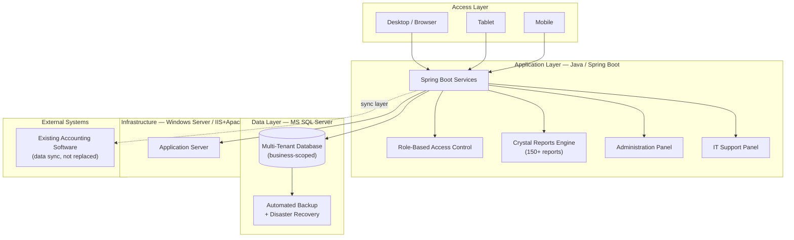
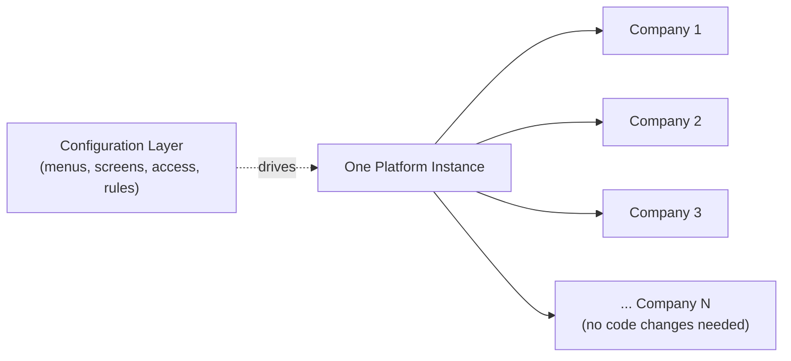
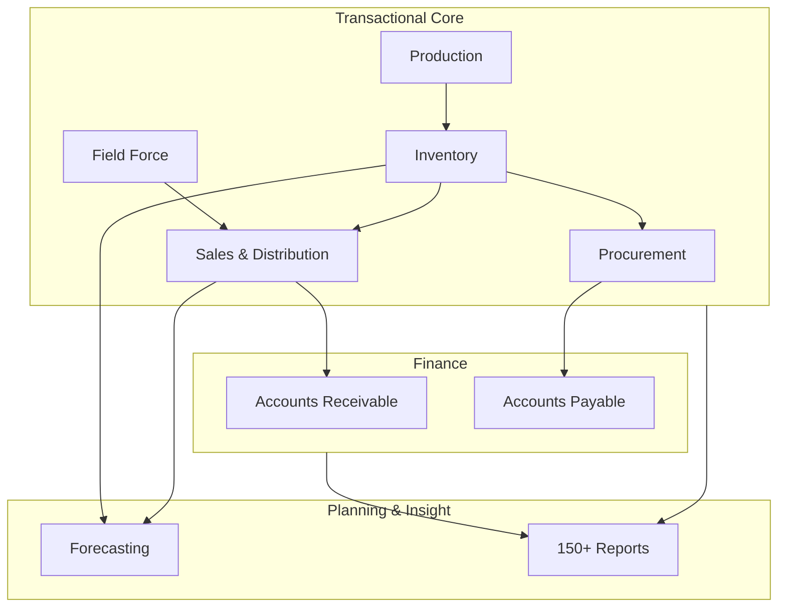

# Architecture at a Glance

A conceptual view of the platform — technology choices and structural patterns, without database schema, stored procedures, or screen-level specifications.

## System layers

## Multi-company scaling model

*Adding company #9 is a configuration exercise, not a development project — this is the core design bet that made "unlimited company scalability" real rather than aspirational. 8 companies are running on it today.*

## Functional module map

## Why this held up in production

- **Isolation by design** — every business unit's data is scoped, so issues in one company's data never bleed into another's
- **Config over code** — the biggest scaling risk in multi-company ERPs is usually "just fork it per client"; this platform deliberately avoided that trap
- **Split admin/support responsibility** — business admins manage their own users, codes, and parameters; IT support has a dedicated panel for platform-level troubleshooting — keeping business users out of technical territory and vice versa
- **Backup/DR treated as a first-class requirement**, not an afterthought, given this platform runs live manufacturing and distribution operations 24/7

---

*Database schema, stored procedures, and screen-level field specifications are intentionally excluded from this diagram.*
